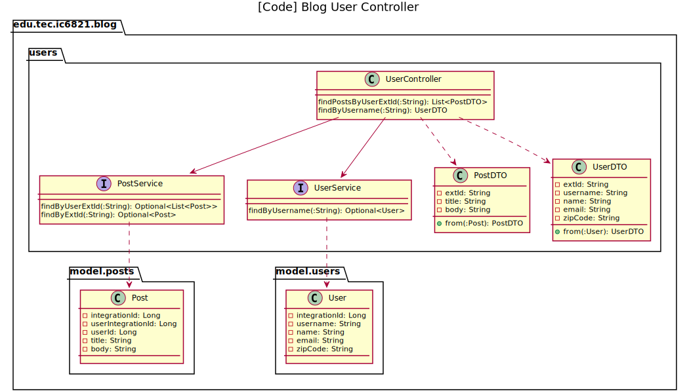

# Blog App Arquitectura #

## Contenidos ##

* [Diagrama de contexto del sistema Blog App](#diagrama-de-contexto-del-sistema)
    * [Diagrama de contenedores Blog App](#diagrama-de-contenedores-blog-app)
        * Diagramas de componentes
            * [API](#diagrama-de-componentes-api)
                * [Sync Data Service](#diagrama-de-código-sync-data-service)
                * [User Entities](#diagrama-de-código-user-entities)
                * [Blog Post Entities](#diagrama-de-código-blog-post-entities)
                * [Sync Controller](#diagrama-de-código-sync-controller)
                * [Blog Post Service](#diagrama-de-código-post-service)
                * [Blog Post Controller](#diagrama-de-código-post-controller)
                * [User Service](#diagrama-de-código-user-service)
                * [User Controller](#diagrama-de-código-user-controller)
            * Single Page Application

## Diagrama de contexto del sistema Blog App ##

## Diagrama de contenedores Blog App ##

## Diagrama de componentes API ##

## Diagrama de código Sync Data Service ##

## Diagrama de código User Entities ##

## Diagrama de código Blog Post Entities ##

## Diagrama de código Sync Controller ##

## Diagrama de código Post Service ##

## Diagrama de código Post Controller ##

## Diagrama de código User Service ##

## Diagrama de código User Controller ##
