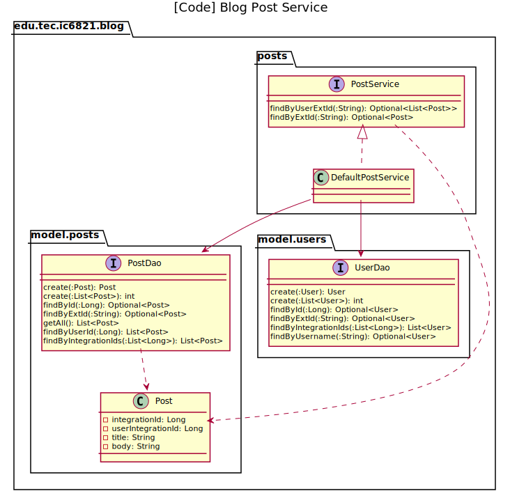

# Tarea corta #9 #

Curso IC-6821 Diseño de software  
Profesor Diego Munguía Molina

## Objetivos ##

* Implementar un diseño arquitectónico para exponer servicios del sistema a través de una pasarela (API).

## Guía de trabajo ##

Continuamos el desarrollo de nuestra aplicación de blogging.

La arquitectura del sistema se documenta en [ARCHITECTURE.md](./ARCHITECTURE.md) utilizando el modelo C4.

Los casos de uso del sistema estarán implementados en un contenedor y serán expuestos, tanto a otros contenedores del 
sistema como a los usuarios administradores, a través de una pasarela REST (API).

### Tarea 1 ###

Implementar los casos de uso relacionados con el contenido de artículos del blog (`Post`) y exponer los servicios a 
través de *endpoints* REST.

Los casos de uso por implementar son los siguientes:

* **R1**. Como usuario Blogger quiero listar todos mis artículos para poder gestionarlos.
* **R2**. Como usuario Blogger quiero acceder al contenido de un artículo para poder gestionarlo.
* **R3**. Como usuario anónimo quiero acceder al contenido de un artículo para leerlo.

El caso de uso **R1** será implementado en `PostService.findByUserExtId(userExtId :String): Optional<List<Post>>`.  

Los casos de uso **R2** y **R3** se implementan en un mismo método 
`PostService.findByExtId(postExtId :String): Optional<Post>`.

El *endpoint* para **R1** ya está implementado en `UserController.findPostsByUserExtId(:String): PostDTO` y se asocia
con el *url* `GET /api/users/{userExtId}/posts`.

El *endpoint* para **R2** y **R3** responderá a `GET /api/posts/{postExtId}` y estará implementado en 
`PostController.findByExtId(:String): PostDTO`.

Debe implementar las clases:

* `DefaultPostService`
* `PostController`

El repositorio GIT ya contiene implementaciones semejantes para los servicios y controladores de `User` y de 
sincronización con el sistema externo. Puede utilizar estas como referencia para completar esta tarea.

**No es necesario agregar ningún método nuevo a nivel de DAOs**.

## Aspectos operativos ##

- No modificar ningún archivo de código ya existente en el repositorio.
- No modificar ninguna prueba automatizada.
- No modificar ningún chequeo de estilo. 
- No utilizar spanglish.
- Escribir código limpio.
- Las pruebas de código verifican todos los requerimientos funcionales.
- Como entrega se considera el último `push` de código al repositorio antes de la revisión del trabajo.
- Puede encontrar información sobre cómo corregir problemas identificados por los chequeos de estilo en el siguiente 
  enlace: https://checkstyle.sourceforge.io/checks.html 

## Rúbrica ##

#### Total 10 pts #### 

#### Entrega (2 pts) ####
- (2 pts) El historial del repositorio contiene commits significativos de la persona estudiante.
- (0 pts) El historial del repositorio no contiene commits significativos de la persona estudiante. Si no hay commits 
  significativos, el resto de criterios no serán aplicados.

#### Chequeo de estilo (2 pts) ####
- (2 pts) El código en el repositorio pasa todos los chequeos de estilo.
- (0 pts) El código en el repositorio no pasa todos los chequeos de estilo.

#### Chequeo de diseño (3 pts) ####
- (3 pts) El código en el repositorio pasa todos los chequeos de diseño.
- (1 pts) El código en el repositorio pasa la mayoría de los chequeos de diseño.
- (0 pts) El código en el repositorio no pasa los chequeos de diseño.

#### Pruebas de código (3 pts)
- (3 pts) El código en el repositorio pasa todas las pruebas de código.
- (1 pts) El código en el repositorio pasa la mayoría de las pruebas de código.
- (0 pts) El código en el repositorio no pasa las pruebas de código.

